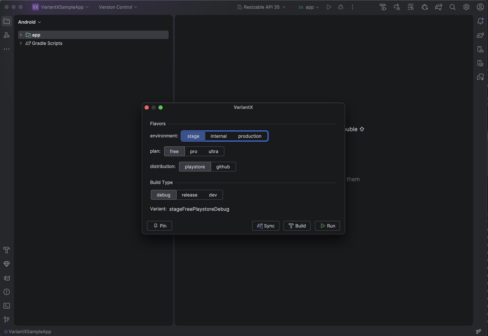
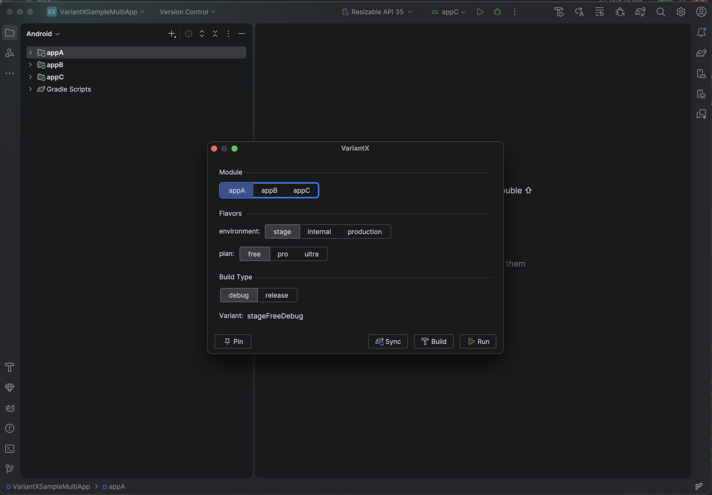
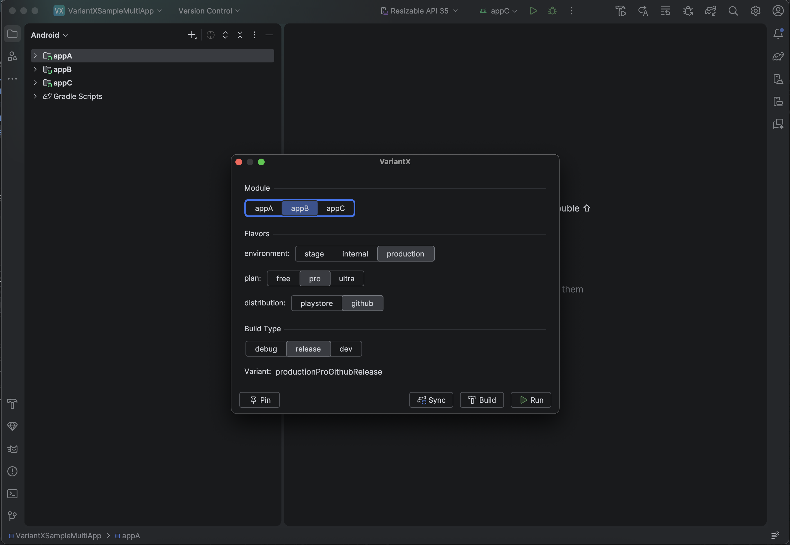
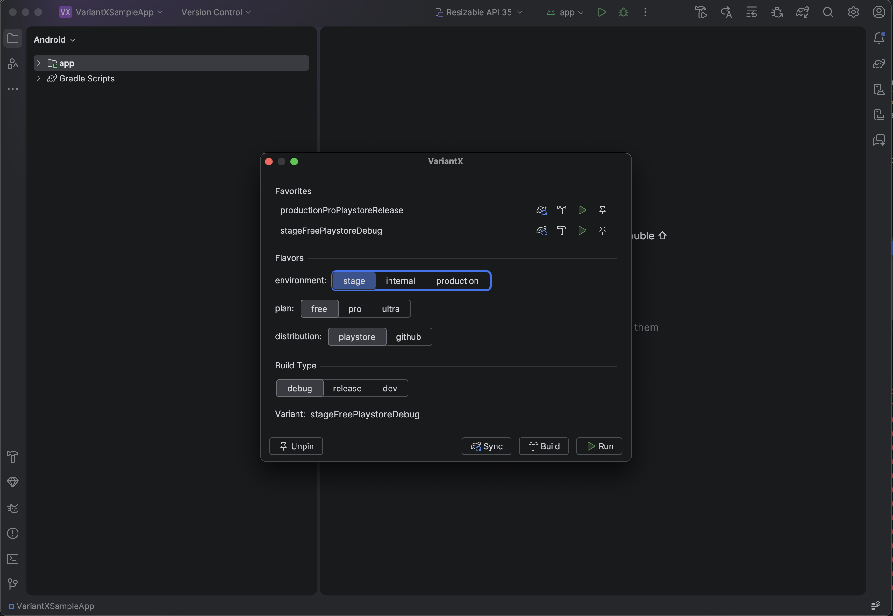

# VariantX

  

  
  

<!-- Plugin description -->
**VariantX** — A fast, keyboard-driven build variant selector for Android Studio.

Switch Android build variants instantly with `Cmd+Shift+X` (macOS) / `Ctrl+Shift+X` (Windows/Linux). No more navigating the Build Variants tool window and clicking through dropdowns.

**Features:**
- **Segmented controls** for flavor dimensions and build types — see all options at a glance
- **Module detection** — automatically detects Android app modules
- **Flavor/dimension matrix** — visual dimension → flavor mapping
- **Pin favorites** — save frequently used variant combinations for one-click switching
- **Set, Build, or Run** — sync the variant, assemble without running, or apply and launch the app
- **Dialog shortcuts** — press `R` / `B` / `S` inside the dialog to trigger Run / Build / Sync instantly
- **Remembers last used** — your last selection is pre-populated on next open
<!-- Plugin description end -->

---

## Why VariantX?

Switching build variants in Android Studio today requires opening the Build Variants panel, scrolling through a table of every module, and clicking each dropdown individually. For projects with multiple flavor dimensions this is tedious and error-prone.

VariantX collapses the entire flow into a single keyboard-invoked dialog.

---

## Screenshots

| Flavor & Build Type | Multi-App |
|---|---|
|  |  |

| Module Switch | Pinned Favorites |
|---|---|
|  |  |

---

## Features

### One Dialog, Everything You Need
Open the dialog with `Cmd+Shift+X` (macOS) or `Ctrl+Shift+X` (Windows/Linux). Pick your flavors and build type, then hit **Sync**, **Build**, or **Run** — or press `S`, `B`, `R` directly on the keyboard.

### Segmented Controls
Every flavor dimension and build type is a segmented button group — all options visible at once, one click to switch, arrow keys to navigate.

### Multi-Module Support
Projects with more than one Android app module get an automatic module picker at the top of the dialog. Switching modules immediately refreshes all flavor and build type options for that module.

### Pin Favorites
Pin any variant combination for instant recall. Favorites appear at the top of the dialog with their own **Sync**, **Build**, and **Run** buttons. Up to 10 favorites per project.

### Remembers Your Last Selection
The last used module, flavors, and build type are restored every time you open the dialog — validated against the current Gradle model so stale state never causes errors.

---

## Keyboard Shortcuts

| Shortcut | Action |
|---|---|
| `Cmd+Shift+X` / `Ctrl+Shift+X` | Open VariantX dialog |
| `S` | Sync (apply variant) |
| `B` | Build (assemble without running) |
| `R` | Run (apply variant and launch) |
| `Escape` | Close dialog |
| `←` / `→` | Navigate between segments in focused row |

---

## Installation

**Via the IDE:**

<kbd>Settings</kbd> → <kbd>Plugins</kbd> → <kbd>Marketplace</kbd> → search **VariantX** → <kbd>Install</kbd>

**Manually:**

Download the [latest release](https://github.com/AxonDragonScale/VariantX/releases/latest) and install via
<kbd>Settings</kbd> → <kbd>Plugins</kbd> → <kbd>⚙️</kbd> → <kbd>Install plugin from disk…</kbd>

---

## Compatibility

Requires **Android Studio 2025.1 (Narwhal)** or later (IntelliJ Platform build 251+).

---

Plugin based on the [IntelliJ Platform Plugin Template][template].

[template]: https://github.com/JetBrains/intellij-platform-plugin-template
